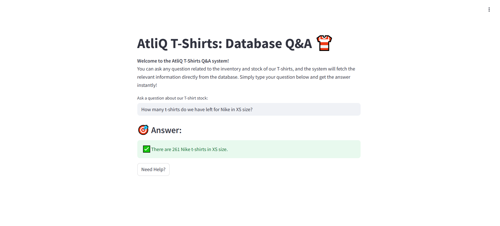

# AtliQ T-Shirts: Database Q&A System 👕 

#### A database query and interaction system for managing T-shirt stock information using LangChain and MySQL. This project provides a simple way to ask questions about the T-shirt inventory, such as how many of a certain brand or color are available.

---

## Installation Instructions

Follow these steps to set up the project on your local machine:

### 1. Clone the repository

```bash
git clone https://github.com/dishagopani05/AtliQ-TShirts-LLM-powered-MySQL-Q-A-App
cd atliq-tshirts
```

### 2. Set up Poetry (if not already installed)
```bash
curl -sSL https://install.python-poetry.org | python3 -
```

After installing, restart your terminal and run:
poetry --version to verify it’s working.

### 3. Install the required packages

Install the required Python libraries listed in requirements.txt:

```bash
poetry install
```

### 4. Configure the environment

Create a `.env` file in the root directory with your configuration:

```env
# MySQL Configuration
DB_USER=root
DB_PASSWORD=root
DB_HOST=localhost
DB_NAME=atliq_tshirts

# API Keys
GEMINI_API_KEY=your_gemini_api_key_here
SERPAPI_API_KEY=your_serpapi_key_here
```

### 5. Run the application

You can start the application by executing the main script:

```bash
poetry run streamlit run app.py 
```

Make sure to visit `http://localhost:8501` in your web browser to interact with the T-shirt inventory system.

### 6. Usage Instructions

Once the application is running, you can interact with the Streamlit UI to query the T-shirt inventory.

##### Features include:

- Search inventory by brand, color, or other attributes
- Get real-time stock information

#### Ask Questions

In the Streamlit interface, type a question such as:

- "How many white Nike T-shirts do we have in stock?"
- "What is the total number of Adidas T-shirts?"

The system will process your query and return a result from the MySQL database.

---

### 7. Screenshots

